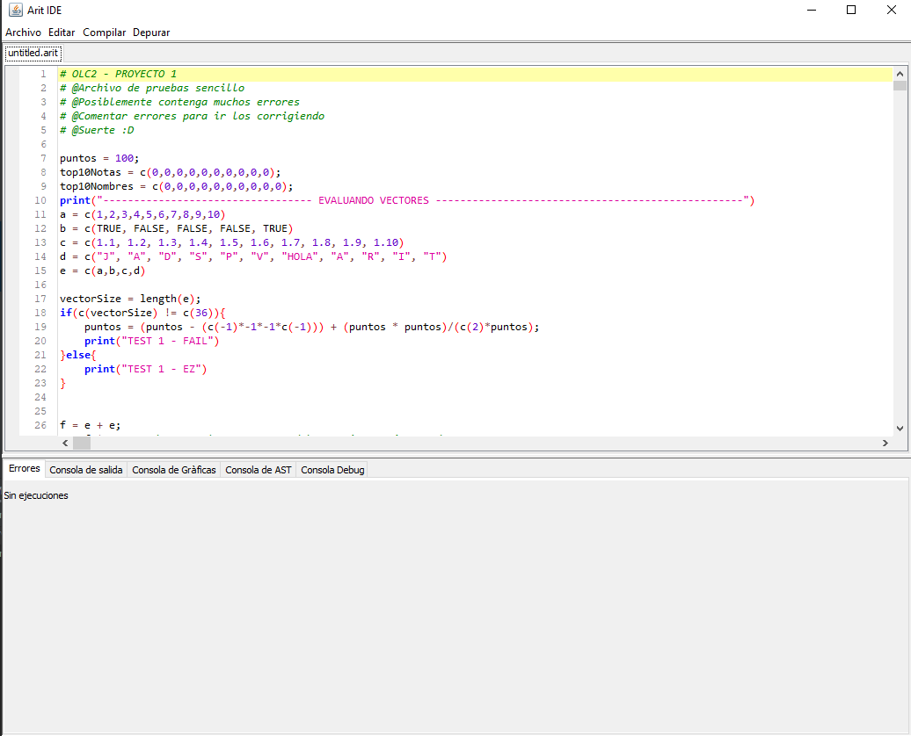
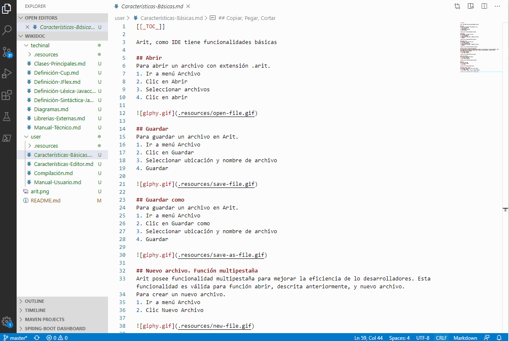

## Arit Software

Arit es un entorno de programación orientado a procesamiento de análiis estadístico.
Contiene un conjunto de herramientas que permiten la integración de programación, implementación de gráficas. 
Contiene un entorno IDE que proporciona las funcionalidades clásicas de un editor de texto para el uso del software.

Se adjuntan los siguientes manuales sobre la documentación de este software.

1. [Manual de Usuario](user/Manual-Usuario.md)
1. [Manual Técnico](techinal/Manual-Técnico.md) 

  

### Adicional

Este markdown puede ser modificado y visualizado (preview) desde Visual Studio Code.  

Adjunto el siguiente link de referencia  donde se indica sintáxis y diferentes funcionalidades del markdown [link](https://docs.microsoft.com/en-us/azure/devops/project/wiki/markdown-guidance?view=azure-devops) 

### Funcionalidades Principales
1. Agregar .gif [example](user/Características-Básicas.md)
2. Agregar segmentos de código java que incluye resaltar palabras reservadas del lenguaje especificado [example](techinal/Definición-Cup.md)
3. Agregar imagenes
4. Diferentes sintaxis para títulos, numeración, etc.