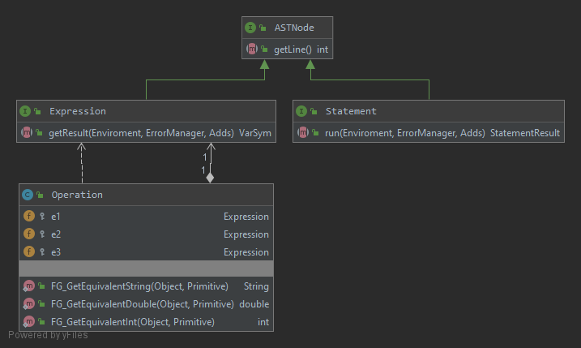

Manual de usuario, especificado para el uso de la herramienta y explicar sus diferentes funcionamientos 

[[_TOC_]]

## ASTNode
  
Arit fue implementado en un patrón de diseño interprete. El nodo más alto del AST es la interfaz ASTNode, luego existen otras dos interfaz que heredan de esta Expression y Statement.
