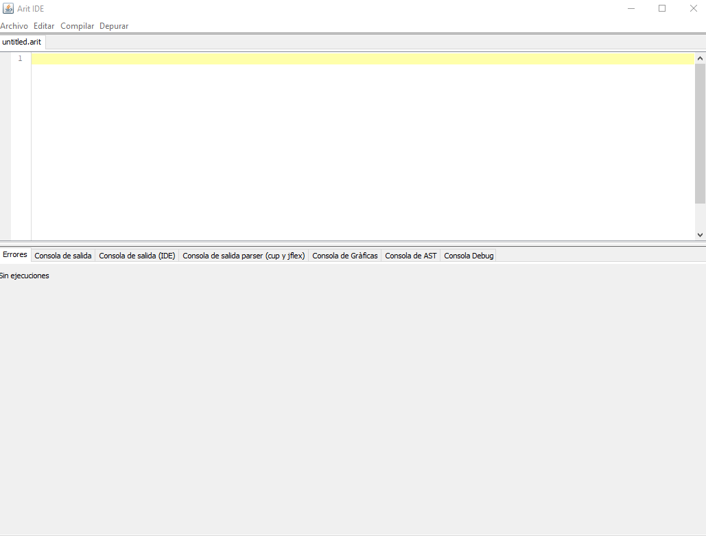
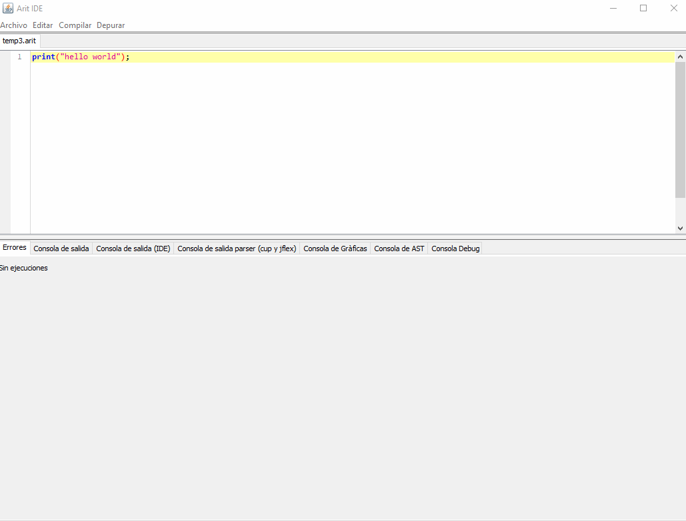
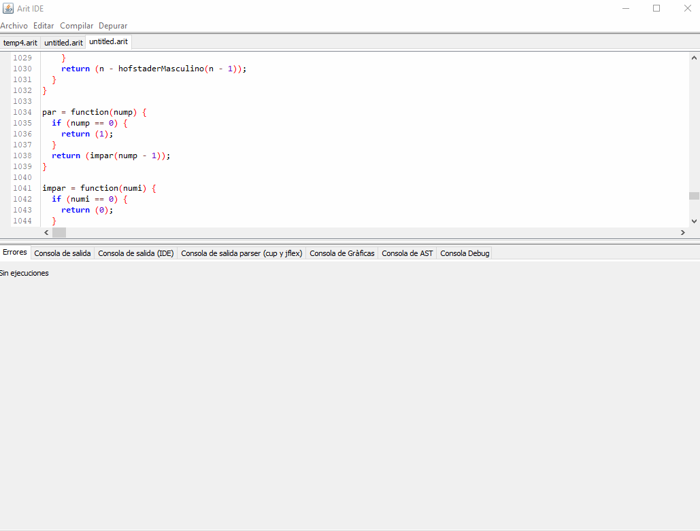
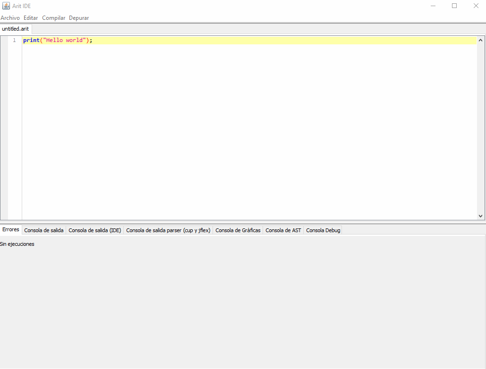

[[_TOC_]]

Arit, como IDE tiene funcionalidades básicas 

## Abrir
Para abrir un archivo con extensión .arit.
1. Ir a menú Archivo
2. Clic en Abrir
3. Seleccionar archivos
4. Clic en abrir 

## Guardar
Para guardar un archivo en Arit.
1. Ir a menú Archivo
2. Clic en Guardar
3. Seleccionar ubicación y nombre de archivo
4. Guardar

## Guardar como
Para guardar un archivo en Arit.
1. Ir a menú Archivo
2. Clic en Guardar como
3. Seleccionar ubicación y nombre de archivo
4. Guardar

## Nuevo archivo. Función multipestaña
Arit posee funcionalidad multipestaña para mejorar la eficiencia de lo desarrolladores. Esta funcionalidad es válida para función abrir, descrita anteriormente, y nuevo archivo.
Para crear un nuevo archivo.
1. Ir a menú Archivo
2. Clic Nuevo Archivo

## Cerrar pestaña
Para cerrar una pestaña actual.
1. Ir a menú Archivo
2. Clic Cerrar pestaña

## Salir
Para salir del IDE.
1. Ir a menú Archivo
2. Clic Salir

## Copiar, Pegar, Cortar
Esta sección se encuentra en el menú Editar
1. Ir a menú Editar
2. Clic Copiar, Pegar o Cortar respectivamente

