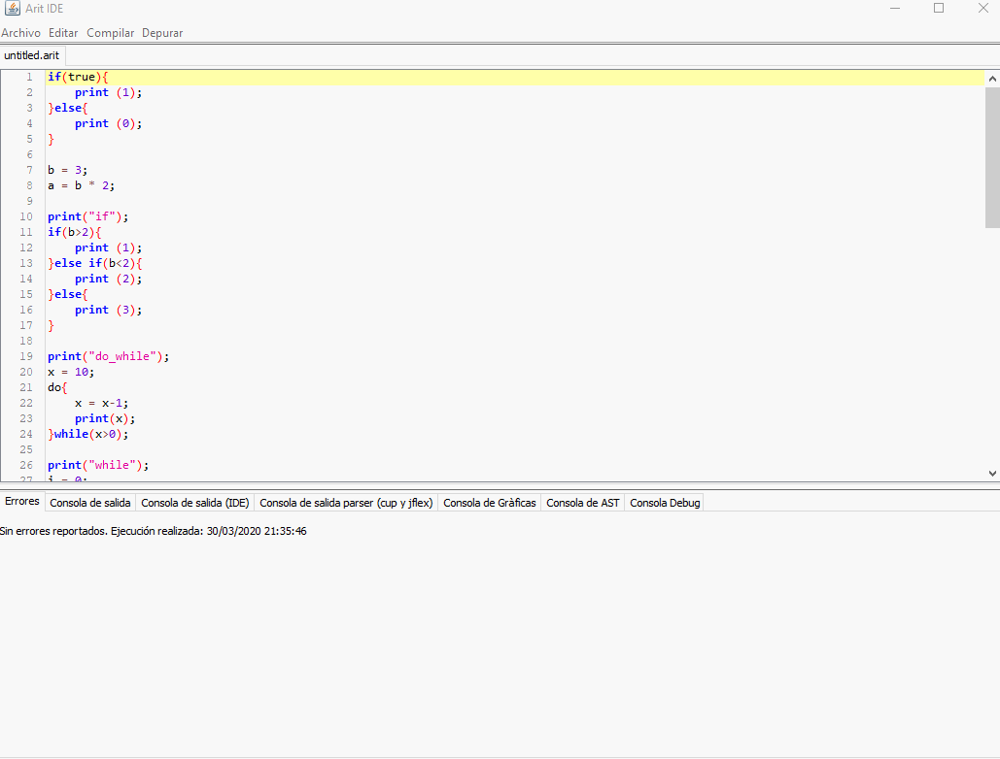
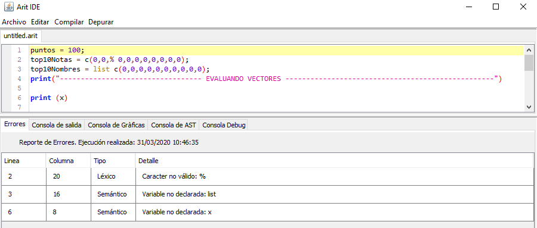
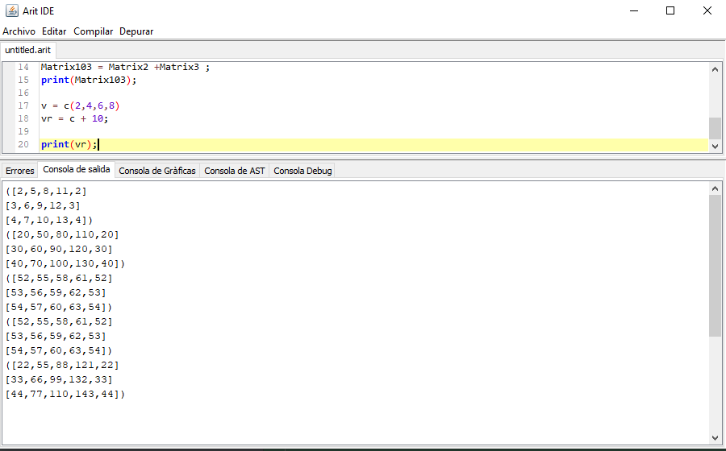
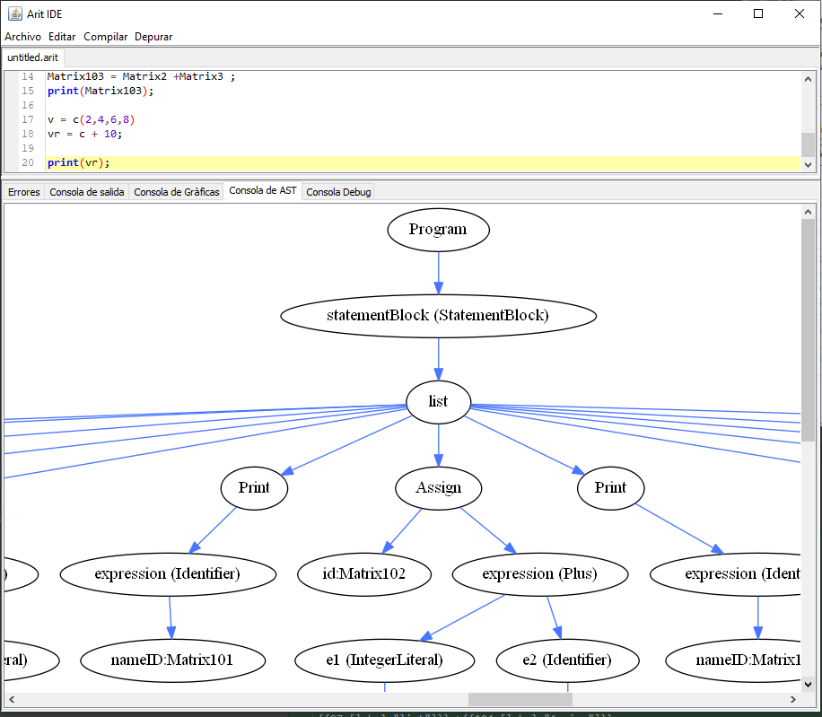
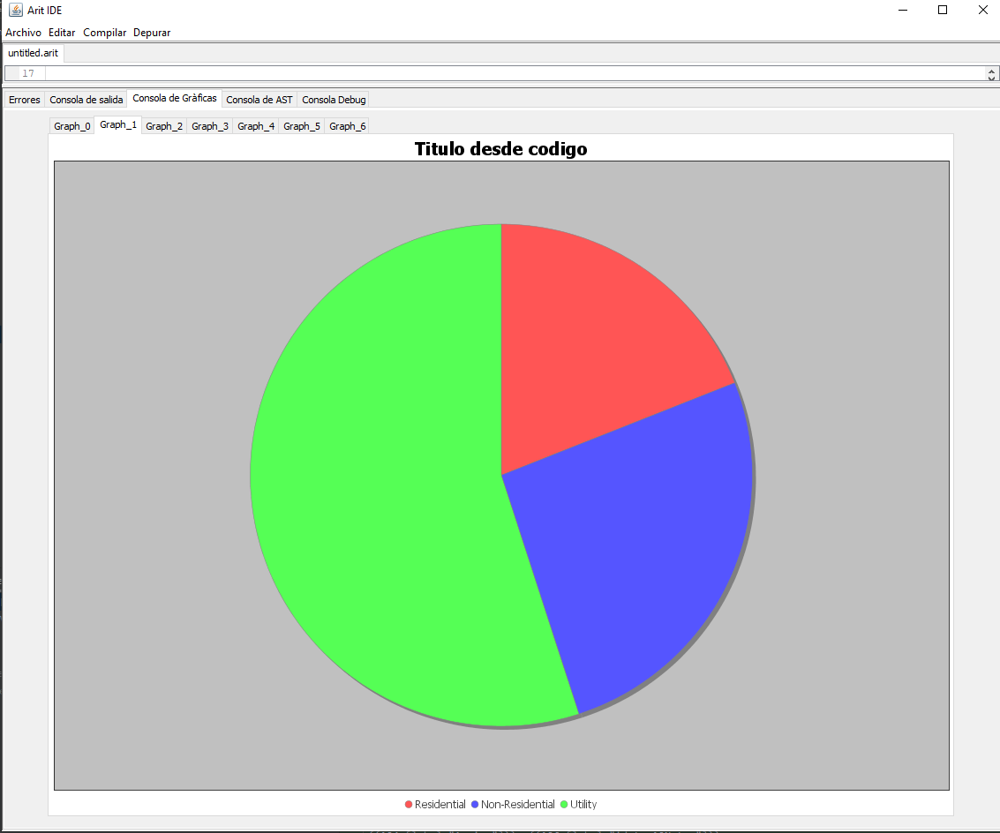
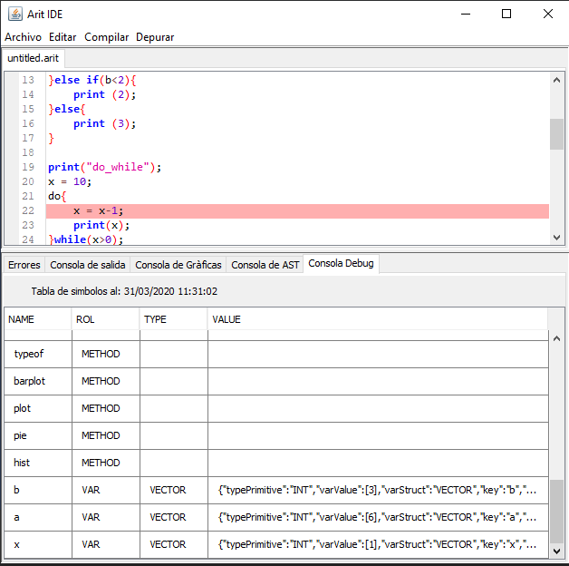

[[_TOC_]]

Compilación de Arit. En esta sección se explica las diferentes maneras de compilar archivos en Arit, y adicional las diferentes areas de trabajo y salidas del mismo.

Arit. Tiene dos módulos de ejecución y dependerá del tipo de analizador deseado. 
1. Java Cup: Analizador ascendente
2. Javacc: Analizador descendente

## Ejecutar
Para ejecutar un archivo con extensión .arit. con analizador ascendente
1. Ir a menú Compilar
2. Clic en Ejecutar Cup

Para ejecutar un archivo con extensión .arit. con analizador descendente 
1. Ir a menú Compilar
2. Clic en Ejecutar Javacc

## Pestaña de errores
Arit cuenta con una sección de reporte de errores, los cuales contiene.
1. Número de línea ubicación del error
2. Número de columna ubicación del error
3. Tipo de error: léxico, sintáctico o semántico
4. Detalle del error

## Pestaña de Consola de salida
Esta sección se mostrará todos los mensajes correspondientes a la función println

## Pestaña de Consola AST
Esta sección se mostrará una imagen correspondiente al árbol de análisis sintáctico de la ejecución.

## Pestaña de Consola Gráficas
Esta sección se mostrará un conjunto de gráficas estadísticas resultantes de la ejecución del programa

## Pestaña de Debug (Tabla de símbolos)
Esta sección se mostrará el reporte con la tabla de símbolos del programa en un específico punto si se utiliza la función debug

Contendrá la siguiente información:
1. Nombre de elemento en la tabla de símbolos
2. Rol: Varible, Método, etc.
3. Tipo de var: vector, lista, matriz, arreglo
4. Contenido explícito del objeto

